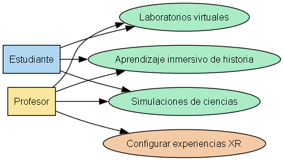
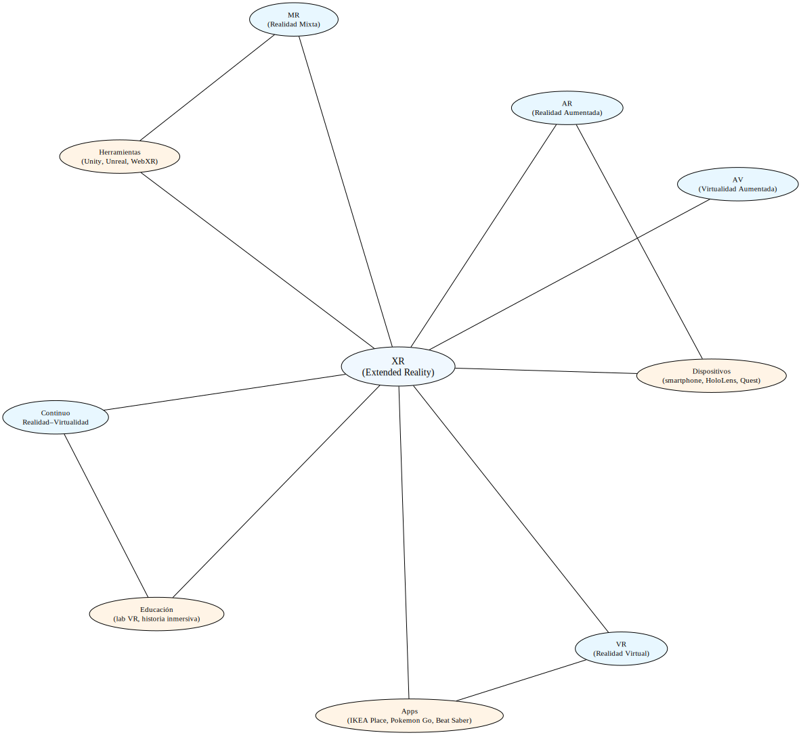

# Diagramas – Módulo 1

## 🖥 Diagramas Generados con Python

Los diagramas de este módulo fueron creados utilizando **Python** y la librería **Graphviz**, demostrando cómo representar visualmente conceptos XR de manera práctica:

## Diagrama: Casos de uso XR en Educación

**Explicación:**  
Este diagrama muestra cómo las tecnologías XR se aplican en un entorno educativo.  
Los actores principales son el estudiante y el profesor.  
El estudiante interactúa con experiencias inmersivas como laboratorios virtuales, aprendizaje de historia o simulaciones de ciencias.  
El profesor puede configurar y guiar estas experiencias, demostrando la colaboración y el flujo de interacción entre usuarios y aplicaciones XR en educación.

---

## Mapa mental de terminología XR

**Explicación:**  
El mapa mental organiza los conceptos fundamentales del módulo 1 de XR.  
En el centro se encuentra XR (Extended Reality), y a su alrededor se conectan los principales conceptos: AR (Realidad Aumentada), VR (Realidad Virtual), MR (Realidad Mixta), AV (Virtualidad Aumentada) y el continuo Realidad–Virtualidad.  
También se muestran casos de uso, dispositivos, aplicaciones y herramientas, ilustrando cómo todos estos elementos interactúan y ayudan a comprender el ecosistema XR.

