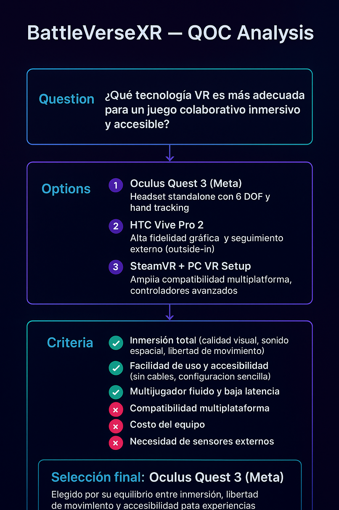
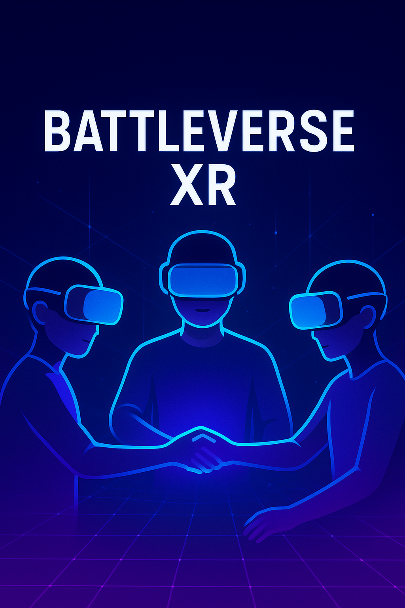

# 🎮 BattleVerseXR — Análisis y Selección de Tecnología XR

## 📘 Curso:
**XR MOOC Specialization Course 1: Intro to AR/VR/MR/XR**  
**Instructor:** Dr. Michael Nebeling  
**Módulo 2 — Tecnología XR y Toma de Decisiones**

---

## 🧠 Escenario Seleccionado
**Categoría:** VR (Realidad Virtual)  
**Escenario:** Collaborative Game  

---

## 🕹️ Título del Proyecto
**BattleVerseXR**

---

## 📝 Descripción
*BattleVerseXR* es una experiencia de **realidad virtual colaborativa** en la que tres amigos se conectan desde distintos lugares para participar en una batalla estratégica en tiempo real. A través de cascos VR y avatares personalizables, los jugadores pueden comunicarse por voz, coordinar movimientos y explorar un entorno inmersivo de ciencia ficción. Esta propuesta busca maximizar la **presencia, interacción social y cooperación** entre los jugadores.

---

## 🌍 Objetivos del Módulo
- Explicar los conceptos clave de la **Realidad Virtual (RV)** y **Realidad Aumentada (RA)**.  
- Diferenciar las tecnologías de RV y RA.  
- Comprender los puntos fuertes y débiles de cada tecnología en aplicaciones XR.  
- Elaborar una lista de tecnologías XR adecuadas para escenarios colaborativos.

---

## ⚙️ Análisis QOC (Questions, Options, Criteria)

### **Question 1:** ¿Qué tipo de visualización debe usarse para maximizar la inmersión?
- **Options:** Head-mounted Display (HMD) | Projective Display | Monitor-based  
- **Criteria:** Nivel de inmersión, libertad de movimiento, costo.  
✅ *Selección:* **Head-mounted Display (HMD)** → Alta inmersión y libertad espacial.

---

### **Question 2:** ¿Cómo debe realizarse el seguimiento (tracking) de los jugadores?
- **Options:** Inside-out tracking | Outside-in tracking | Marker-based  
- **Criteria:** Precisión, facilidad de instalación, costo de hardware.  
✅ *Selección:* **Inside-out tracking** → Preciso y sin sensores externos.

---

### **Question 3:** ¿Qué método de interacción es más adecuado para un juego colaborativo?
- **Options:** Controladores físicos | Hand tracking | Eye tracking  
- **Criteria:** Naturalidad, precisión, curva de aprendizaje.  
✅ *Selección:* **Controladores físicos con soporte para hand tracking** → Ideal para acciones rápidas y gestos naturales.

---

## ⚖️ Evaluación de las Tecnologías

| Tecnología | Ventajas | Desventajas |
|-------------|-----------|--------------|
| **VR Headsets (Meta Quest, HTC Vive, Valve Index)** | Inmersión total, soporte multiplataforma, comunicación por voz | Requiere hardware dedicado |
| **Inside-out Tracking** | Sin sensores externos, buena precisión | Puede fallar con poca luz |
| **Hand Tracking** | Interacción natural, sin controladores | Limitado en precisión |
| **Eye Tracking (opcional)** | Permite análisis de atención y realismo | Costo elevado |

---

## 💡 Conclusión
La **Realidad Virtual (VR)** ofrece la mejor opción para este escenario, al proporcionar un entorno completamente inmersivo y sincronizado para los jugadores, fomentando la colaboración en tiempo real.  
*BattleVerseXR* aprovecha las fortalezas del **inside-out tracking** y de los **HMDs modernos**, equilibrando inmersión, precisión y accesibilidad.

---

## 🖼️ Material de Apoyo

**Análisis QOC:**  
  

Representación visual del análisis QOC con las preguntas, opciones, criterios y la selección final.

**Imagen conceptual:**  
  
🎮 Futurista colaborativo: avatares con cascos VR en un entorno digital azul o púrpura, conectando sus manos como símbolo de trabajo en equipo.

---

## ❓ Pregunta para el debate
> ¿Crees que la interacción mediante gestos y reconocimiento de manos podrá reemplazar completamente los controladores físicos en los juegos VR colaborativos?

---

