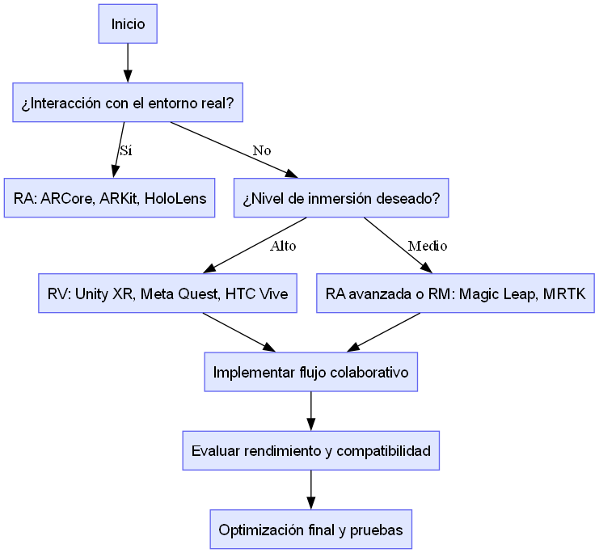

# 🧭 XR_Flujo_Decision

## Descripción general

El archivo **`XR_Flujo_Decision.png`** representa un **diagrama de flujo de decisión** creado en **Python** utilizando la librería `graphviz`.  
Este diagrama visualiza el proceso lógico que seguimos para seleccionar la tecnología **XR (Extended Reality)** más adecuada según los objetivos del proyecto **BattleVerseXR**.

## Objetivo del diagrama

El propósito fue **modelar gráficamente las decisiones clave** que se toman al comparar entornos **VR, AR y XR**, teniendo en cuenta factores como:

- Nivel de inmersión requerido.  
- Interacción colaborativa entre usuarios.  
- Recursos de hardware disponibles.  
- Compatibilidad con plataformas educativas o de simulación.

## Estructura del flujo

El flujo comienza con la pregunta **“¿Qué tipo de experiencia deseas crear?”**, y a partir de ahí se ramifica en distintas rutas de decisión:

- Si la prioridad es **inmersión total**, el camino lleva a **Realidad Virtual (VR)**.  
- Si se busca **superposición de objetos digitales en el entorno real**, la elección es **Realidad Aumentada (AR)**.  
- Cuando se necesita una **combinación de ambas experiencias** o una **colaboración inmersiva**, se opta por **XR (Mixed/Extended Reality)**.

## Resultado

El diagrama final —guardado como **`XR_Flujo_Decision.png`**— resume la **lógica de selección tecnológica** de manera clara y visual.  
Fue generado mediante código Python para mantener la trazabilidad y poder reproducir el análisis dentro del repositorio del módulo.

